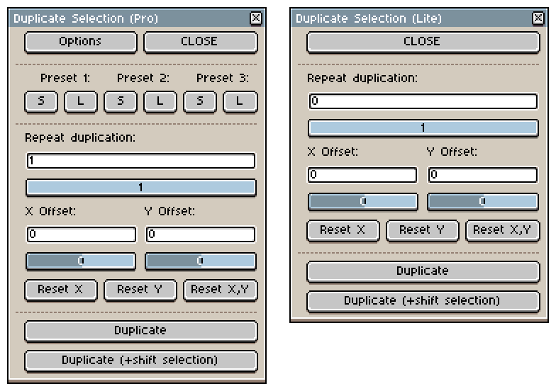
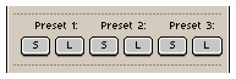
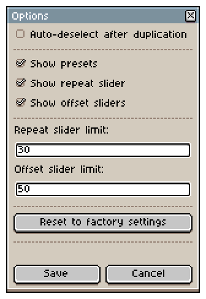
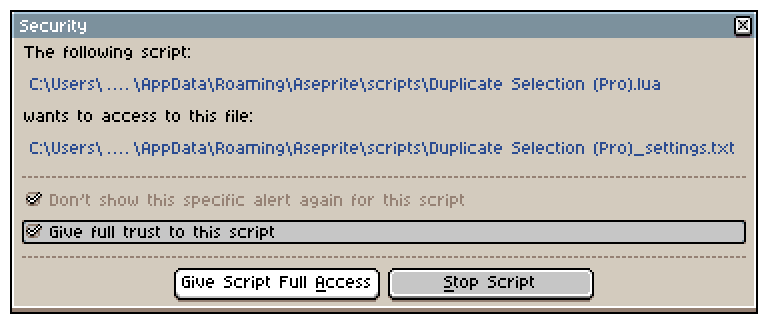

# _Duplicate Selection_ Tool for Aseprite

An Aseprite script that **duplicates the current selection** on the active layer with a customizable **X/Y offset**, **repeat count**, and **preset system**.<br>
It features persistent settings across sessions and a dynamic interface with optional controls.

The script comes in two editions: **Pro** and **Lite**, the latter one being a simplified version with no customizable settings.<br>
This README describes only the Pro edition; some features mentioned here do not apply to the Lite edition.




## Features

- Duplicate the selection within the same layer using a defined X/Y offset.
- **Repeat duplication** multiple times using adjustable step values.
- **Shift the selection mask** by the same offset after duplication (optional).
- **Presets** for storing and reusing frequently used offset/repeat combinations.
- **Settings menu** to customize dialog [components and behavior](#options-menu):
    - Toggle visibility of sliders and preset controls.
    - Adjust repeat and offset slider ranges.
    - Enable/disable automatic deselection.
- Offset input via numeric fields and/or sliders.
- _Reset X_, _Reset Y_, and _Reset X,Y_ buttons to quickly zero the offset values.
- All user settings are persisted in an external [settings file](#settings-file).
- Supports rectangular and non-rectangular (lasso) selections.


## Installation

1. Place the `.lua` file into your Aseprite `scripts` folder.

    **Example path:**  
    _C:\Users\USERNAME\AppData\Roaming\Aseprite\scripts_

2. In Aseprite, go to:  
`File > Scripts > Rescan Scripts Folder` <br>
(or press <kbd>F5</kbd>)

3. The script will appear under:  
`File > Scripts > Duplicate Selection (Pro).lua`


## Usage

1. Run the script:  
   `File > Scripts > Duplicate Selection (Pro).lua`<br>
   (I recommend assigning a keyboard shortcut, e.g. <kbd>Ctrl + D</kbd>)
2. **Make a selection** in your sprite (lasso, rectangle, etc.).
3. Adjust:
   - `X` and `Y` offset (numeric input or slider).
   - `Repeat` count (how many times the selection should be duplicated).
4. (Optional) Save or load one of three available presets.

4. Use one of the action buttons:
    - **Duplicate**: Duplicates the selected area at the specified offset.
    - **Duplicate (+shift selection)**: Duplicates and shifts the selection by the same offset.
6. Close the dialog when finished (settings are saved automatically).

<br>


<br>
  
> The dialog window stays open until manually closed, enabling continuous editing.

<br>

## Presets

The script supports three presets for quickly _storing and applying offset + repeat_ combinations.



Each preset has:

- **S** (Save): Stores current offset and repeat values.
- **L** (Load): Loads stored values into the interface.

Presets are saved to the external [settings file](#settings-file) automatically.


## Options Menu

Click the **Options** button to open the settings dialog:



- **Auto-deselect**: Clears selection after duplication.
- **Show presets**: Toggle visibility of preset controls.
- **Show repeat slider**: Show/hide repeat slider.
- **Show offset sliders**: Show/hide X/Y offset sliders.
- **Repeat slider limit**: Max range for repeat count.
- **Offset slider limit**: Min/max range for X/Y offset.
- **Reset to factory settings**: Reverts all settings (including presets) to defaults.


## Settings File

The script stores the last used values in a plain text file located next to the script:

**File:**  
`Duplicate Selection (Pro)_settings.txt`

During the first run, you will be asked to give permission to the script to access the settings file.<br>
A non-ideal, but headache-avoiding solution.



It's recommended to _Give Script Full Access_, since the file contains only plain text with settings.

**Example content (default values):**  
```pre
-- Last used duplication offsets --
x_offset=0
y_offset=0

-- Last used repeat duplication count --
repeat=1

-- Position and dimensions of the dialog box --
dlg_x=21
dlg_y=42
dlg_w=183
dlg_h=266

-- Presets --
preset_1_x=16
preset_1_y=0
preset_1_repeat=1
preset_2_x=0
preset_2_y=16
preset_2_repeat=1
preset_3_x=4
preset_3_y=-2
preset_3_repeat=1

-- Options --
deselect=0
show_presets=1
show_repeat_slider=1
show_offset_slider=1
repeat_slider_limit=30
offset_slider_limit=50
```
<br>

> If the file does not exist, it will be created automatically on first use.

<br>

## Notes

- Non-rectangular selections (e.g. lasso) are fully supported.
- The script operates on the **active cel** of the **active layer**.
- No duplication occurs if:
    - No selection is made.
    - No active cel is present.
- Transparent background is preserved, and cel bounds are auto-cropped to enclose duplicated content.


## Source Files

Both **Pro** and **Lite** editions are generated from a single source file: `Duplicate Selection_source.lua`.<br>
To build the two versions from this source, follow these steps:

1. Download all files from the `src` directory.
2. Run the `PRO_AND_LITE.bat` batch file.
3. This will execute a Lua script that generates:
    - `Duplicate Selection (Pro).lua`
    - `Duplicate Selection (Lite).lua`
4. Continue with the [Installation](#installation) section.


## License

This script is licensed under the Creative Commons Attribution-NonCommercial-ShareAlike 4.0 International License (**CC BY-NC-SA 4.0**).

You are free to _use_, _modify_, and _share_ it for _non-commercial_ purposes, with attribution.  
If you modify or build upon this script, you must distribute your contributions under the same license.

Full license text: [creativecommons.org](https://creativecommons.org/licenses/by-nc-sa/4.0/)

---

**Author:** chujo<br>
**Version (Pro):** 1.0.0 (2025-04-18)<br>
**Version (Lite):** 1.0.0 (2025-04-18)
